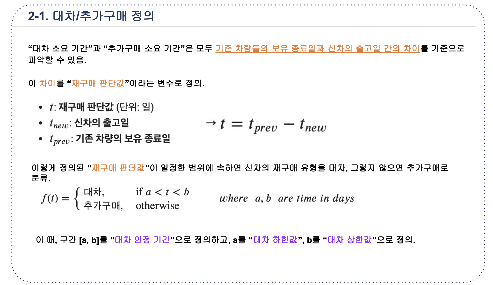
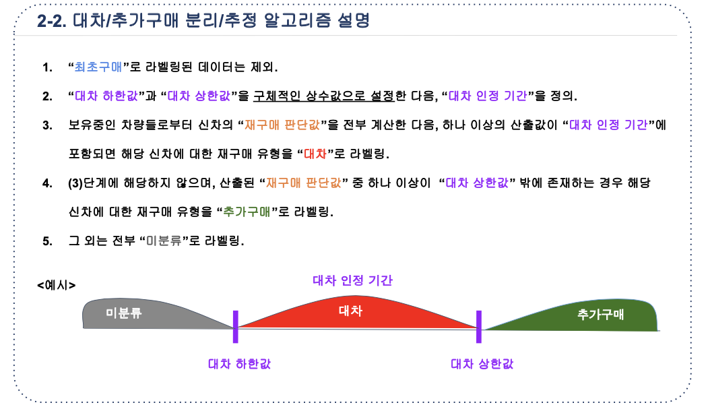
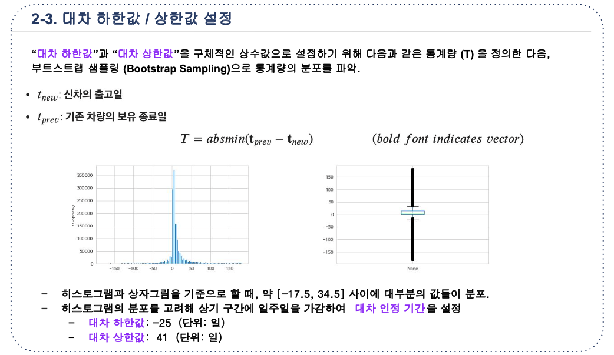
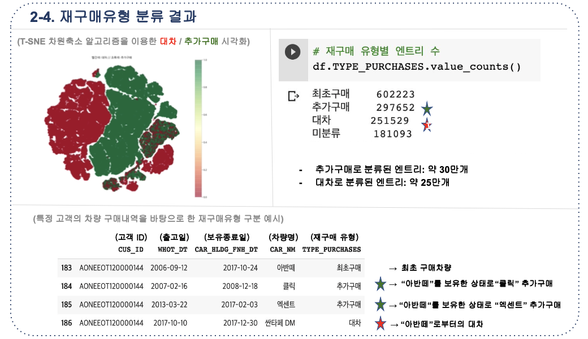
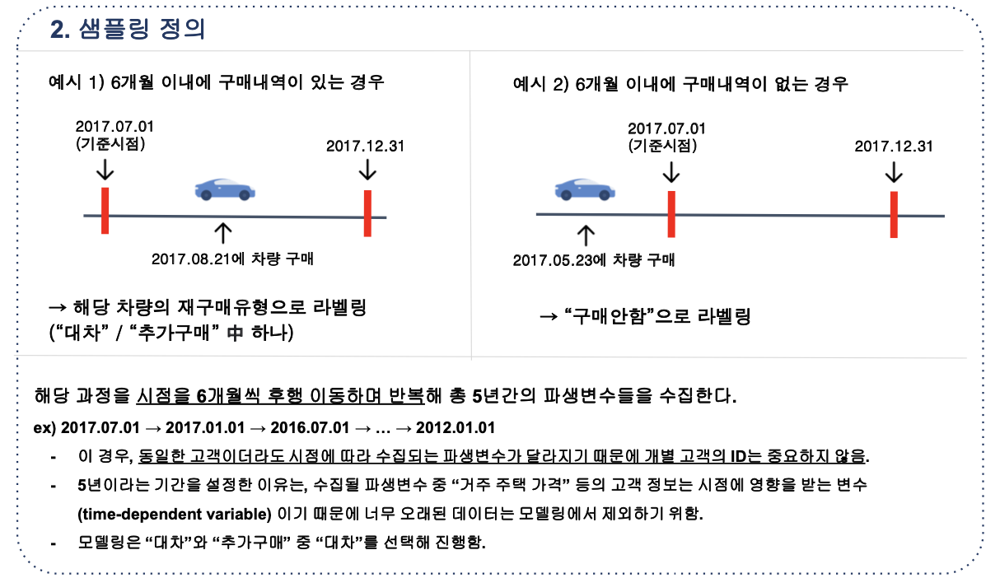
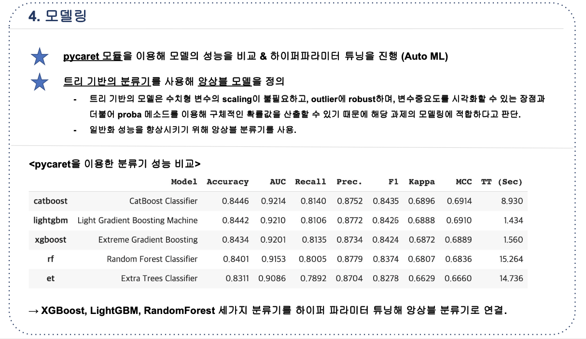
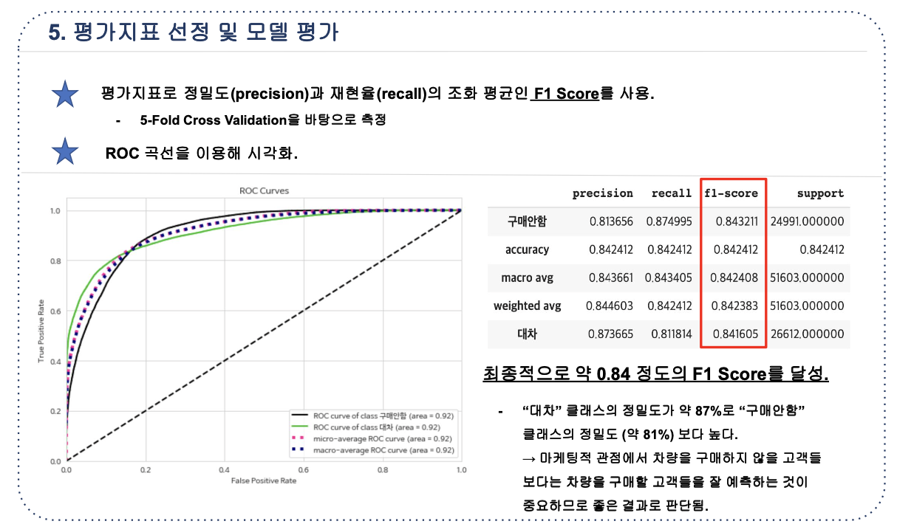
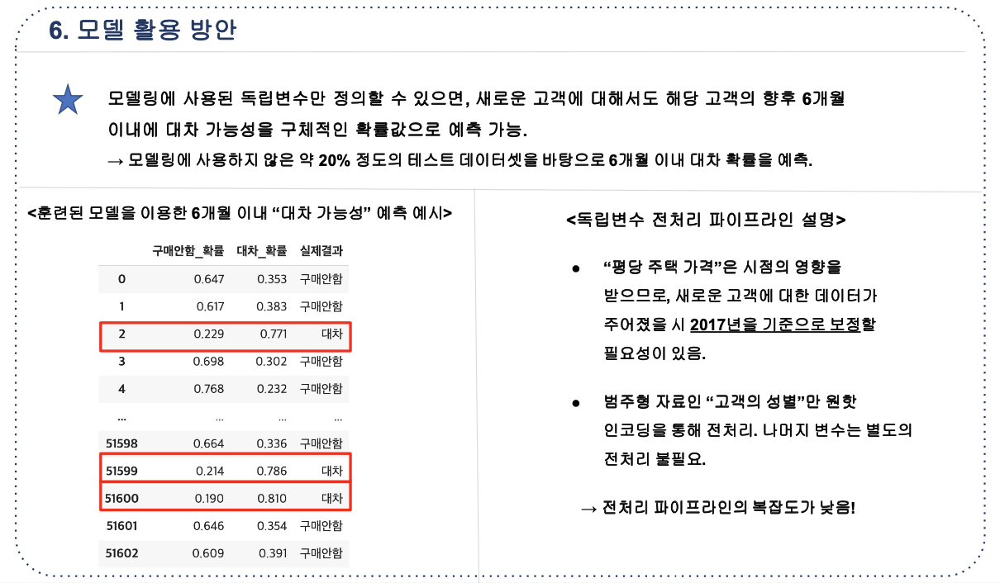

# 2021-1 현대자동차 데이터분석 해커톤

 

2021-1 현대자동차에서 주관한 재구매 고객 맞춤형 마케팅을 위한 데이터분석 해커톤 코딩 소스와 결과서 (데이터 제외)

 

---

## Task 1

- 주어진 가상 구매 고객 데이터를 바탕으로 재구매고객 유형에 대한 분리/추정 로직 개발
- "대차" 및 "추가구매" 구분 결과에 대해 EDA를 수행해 인사이트 도출

 

- EDA 결과는 pdf 참고

 

---

## Task 2

- 고객 별 6개월 내 "대차" 가능성에 대한 예측 모델 개발.

